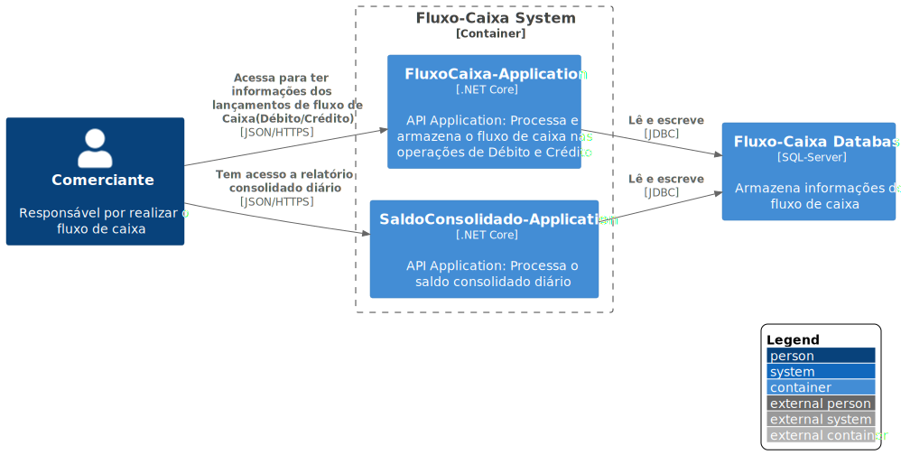

# C2 - Container

Nesse nível, você pode ver detalhes do sistema descrevendo os seus containers (não confunda com o Docker) e como eles se comunicam/interagem. Aqui, a ênfase é na arquitetura e tecnologias utilizadas. A ideia é mostrar como o sistema é de forma macro e como um container pode ser uma aplicação web, um database, um sistema de arquivos, etc..

# Arquitetura

O Sistema foi contruído utilizando abordagem de serviços isolados e possui os seguintes módulos (cada módulo é um container):

- **Controle Lançamentos** : É um serviço de backend que faz o controle de todo o lançamento da empresa (Débito/Crédito)
- **Saldo Consolidado** : É um serviço de backend que disponibiliza o saldo diário consolidado

