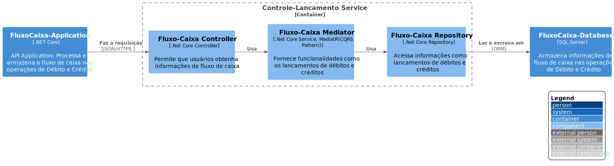

# Controle-Lancamento

`\C3 - Component\Controle-Lancamento`

* [C4Model](../../README.md)
  * [C1 - Context](../../C1%20-%20Context/README.md)
  * [C2 - Container](../../C2%20-%20Container/README.md)
  * [C3 - Component](../../C3%20-%20Component/README.md)
    * [**Controle-Lancamento**](../../C3%20-%20Component/Controle-Lancamento/README.md)
    * [Saldo-Consolidado](../../C3%20-%20Component/Saldo-Consolidado/README.md)

---

[C3 - Component (up)](../../C3%20-%20Component/README.md)

---

Serviço backend em .Net Core, responsável por fazer o controle dos lançamento de caixa (Débit/Crédito)

